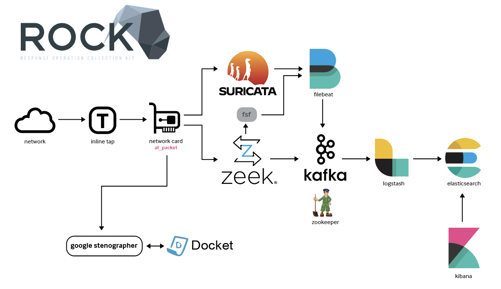
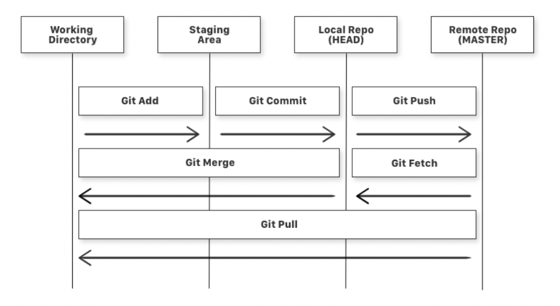

# Headers 
`# This is a heading`

## This is a 2 heading
`# This is a heading`

### this is a 3 heading
`# This is a heading`


#### this is a 4 heading
`# This is a heading`


##### this is a 5 heading
`# This is a heading`


###### this is a 6 heading
`# This is a heading`

---
## **Bolding**  
**bold text**  

__bold text also__

---
## *Italics*
*this is italicized*

---

## Bold and Italics

***bold and italics***

___also b and i___

*__also b and i__*

**_also b and i_**

---
## Strikethroughs
~~here is how you strikethrough~~

--- 

## Quotes
> this is a quote


--- 

## Bulleted lists
Heres my list: 
- item
- item

- item
  - item  
    - item  


--- 

## Code blocks

```
Here is my code block 
for(int i = 0; i < 100>;i++){
    print(sup); 
}
```

`sudo systemctl start kibana`

```
    ```
    ???
    ```
```

--- 
## Numbered lists
1. One
1. Two
1. Three
4. Four
4. Auto numbers for you, doesnt care what number you actually type


--- 
## Links for notes

### Online link
[elastic](https://elastic.co)


### local link - link something else from your repository
[front door to this repo](README.md)

type a "." and it will give you options for local files in the repo

---


## Tables 

`|Column 1|Column 2| Column 3 | Column 4 |
| ------ | ------ | -------- | -------- |
| Data1  | Data2  | Data3    | Data4    |
| Data5  | Data6  | Data7    | Data8    |`


|Column 1|Column 2| Column 3 | Column 4 |
| ------ | ------ | -------- | -------- |
| Data1  | Data2  | Data3    | Data4    |
| Data5  | Data6  | Data7    | Data8    |

---

## Images

It helps to add your own images folder to the repo to help stay organized



