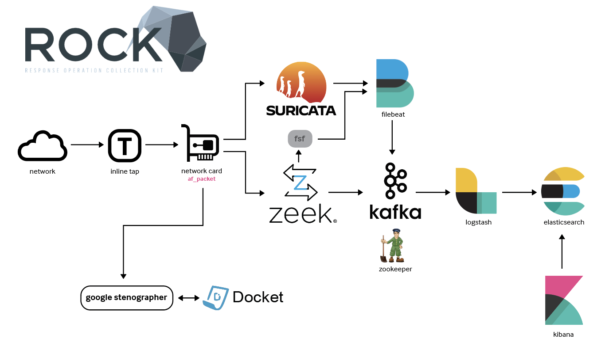

<insert flowchart png>

# Remember:
## Start right to left OR left to right
## check firewalls 
## identify which logs are not coming to kibana so you know where to start
## check spelling and port numbers

# Zeek 
## Commands to verify Zeek
- `sudo -u zeek zeekctl status`
- `sudo -u zeek zeekctl deploy`

## Files
- `sudo vi /usr/share/zeek/site/scripts/kafka.zeek`

## Directories
- /data/zeek
- 

# Suricata
## Commands to verify Suricata
- `sudo systemctl status suricata`

## Files

## Directories
- /data/suricata

# FSF

# Logstash
## Commands to verify Logstash
- look for topic names and servers
-`sudo vi /etc/logstash/conf.d/logstash-100-input-kafka-zeek.conf`
- `sudo tail -f /var/log/logstash/logstash.plain`

## Files

# Kafka
## Kafka commands
### Create topics
`sudo /usr/share/kafka/bin/kafka-topics.sh --bootstrap-server pipeline0:9092 --create --topic zeek-raw --partitions 3 --replication-factor 3`
`sudo /usr/share/kafka/bin/kafka-topics.sh --bootstrap-server pipeline0:9092 --create --topic fsf-raw --partitions 3 --replication-factor 3`
`sudo /usr/share/kafka/bin/kafka-topics.sh --bootstrap-server pipeline0:9092 --create --topic suricata-raw --partitions 3 --replication-factor 3`
### List topics in Kafka cluster
`sudo /usr/share/kafka/bin/kafka-topics.sh --bootstrap-server pipeline0:9092 --list`
### Topic information
`sudo /usr/share/kafka/bin/kafka-topics.sh --bootstrap-server pipeline0:9092 --describe --topic zeek-raw`
`sudo /usr/share/kafka/bin/kafka-topics.sh --bootstrap-server pipeline0:9092 --describe --topic suricata-raw`
`sudo /usr/share/kafka/bin/kafka-topics.sh --bootstrap-server pipeline0:9092 --describe --topic fsf-raw`
### Validate logs (option: add --from-beginning)
`sudo /usr/share/kafka/bin/kafka-console-consumer.sh --bootstrap-server pipeline0:9092 --topic zeek-raw`
`sudo /usr/share/kafka/bin/kafka-console-consumer.sh --bootstrap-server pipeline0:9092 --topic suricata-raw`
`sudo /usr/share/kafka/bin/kafka-console-consumer.sh --bootstrap-server pipeline0:9092 --topic fsf-raw`

### Commands to verify Kafka topics
- `sudo /usr/share/kafka/bin/kafka-console-consumer.sh --bootstrap-server pipeline0:9092 --topic zeek-raw`

